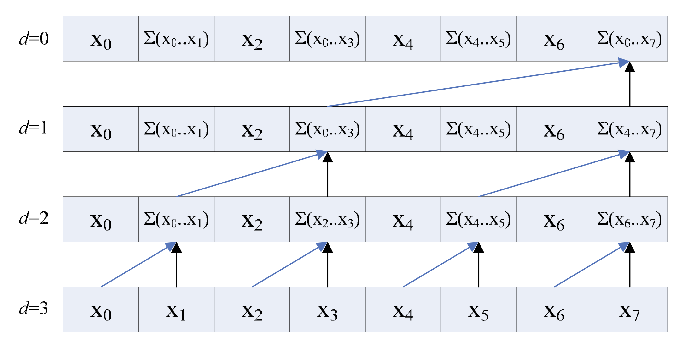
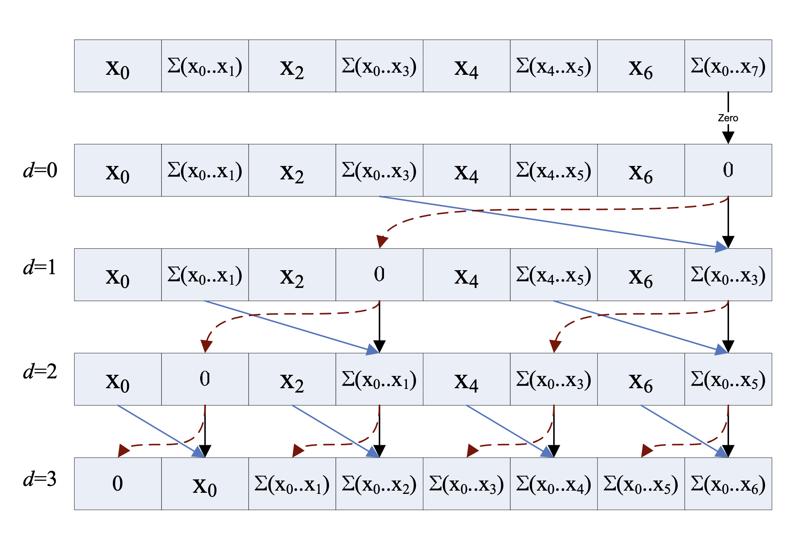

# Blelloch Scan

## Background

Scan是说, 对于一个序列：$x_0, x_1, x_2, \cdots$，我想要得到：

- $y_0 = x_0$
- $y_1 = x_0 + x_1$
- $y_2 = x_0 + x_1 + x_2$
- $\cdots$

串行版本很简单，时间复杂度和工作量都是 $O(n)$

```C++
void Scan(
  const std::vector<int>& input,
  std::vector<int>& output
) {
  output.at(0) = 0;
  for (int i = 1; i < input.size(); i++) {
    output.at(i) = input.at(i) + input.at(i-1);
  }
}
```

Blelloch Scan是一种work-efficient的GPU上的[Scan](https://en.wikipedia.org/wiki/Prefix_sum)的实现, [根据这里的介绍](https://developer.nvidia.com/gpugems/gpugems3/part-vi-gpu-computing/chapter-39-parallel-prefix-sum-scan-cuda), Blelloch Scan的好处是它所需要的工作量和串行的版本差不多,渐进(asymptotically)都是$O(n)$. 但是相比于串行版本很难理解。

分为两个阶段：

### Up-sweep (Reduction)
感觉叫做UpSweep是因为这个步骤是从输入的一个个单独的元素，两两一组作为逻辑上的二叉树的两个子节点，把sum的值传递给父节点。


- **for** $d=0$ to $\log_{2}{(n-1)}$ **do**

  - **for all** $k=0$ to $n-1$ by $2^{d+1}$ in parallel **do**

    - $x[k + 2^{d+1} - 1] = x[k + 2^{d} - 1] + x[k + 2^{d+1} -1]$

Up-sweep阶段，父子节点其实是前后步骤之间，序列中某个元素如何变化的关系，将两个元素（左右子节点）的sum存储到父节点。

同时也可以发现：
1. Up-sweep阶段在$d < \log_2{n}$的步骤，不会最大化利用尽可能多的线程
2. Up-sweep的工作量是$O(n)$



### Down-sweep
Down-sweep阶段反过来，我们这里实现的是exclusive scan，所以把根节点存储的值设为0，这个值会传递下去加到每一个元素上。

- $x[n-1] = 0$
- **for** $d=\log_{2}{(n)}$ down to $0$ **do**

  - **for** $k=0$ to $n-1$ by $2^{d+1}$ in parallel **do**

    - $t = x[k + 2^d - 1]$

    - $x[k + 2^d - 1] = x[k + 2^{d+1} - 1]$

    - $x[k + 2^{d+1} - 1] =  t + x[k + 2^{d+1} -1]$



对于upsweep阶段，我的理解是，upsweep阶段得到的每个节点的左孩子存储了左子树的区间和，例如$A_3$的左子树的范围是$x_0 \cdots x_1$, 那左孩子$A_1$存储的值是$\sum_{i=0}^{1}x_i$，这张图里面我用绿色全部标记了出来。


如何把upsweep的结果，转化成prefix-sum呢？需要在down-sweep阶段：
- 从根节点一层一层一直到叶子节点
  - 每一层都将父节点的值——也就是已经算的部分前缀和，传到左节点，
  - 每一层都将父节点的值——也就是已经计算的部分前缀和，加上右节点的左兄弟的值——也就是父节点的左子树的区间和。

进行到叶子节点就还原了整个数组的前缀和。
感觉太烧脑了，只有画图才能够明白这个步骤。


Blelloch在[Introduction to Parallel Algorithms的4.1节](https://www.cs.cmu.edu/~guyb/paralg/paralg/parallel.pdf)给出了一个递归形式算法的证明，我们上面描述的是迭代的，所以只能参考一下，不过对于理解左子树，右子树的操作的含义很有帮助。

## OpenCL Implementation

### 计算一个tile的prefix-sum

这是一个tile内的数组的Blelloch Scan的实现，加了详细的注释，包括每一步的中间结果，每一个步骤用了几个thread。

```C
// ------------------------------------------------------------------
// This kernel performs an exclusive prefix sum (also known as scan)
// on a block of data using Blelloch's algorithm (work-efficient scan)
//
// Each work-group operates on a tile of data independently,
// using local memory as a scratch space for summation magic.
// Results are written back to global memory, and optionally,
// the total sum of each tile can be stored in `tile_sums`.
// ------------------------------------------------------------------

__kernel void scan(
    __global int* data,        // Input/output array in global memory
    __global int* tile_sums,   // Optional output of per-tile total sums
    __local int* temp,         // Local scratch space for scan
    const int N                // Total number of elemenets
){ 
    // Identify this thread's global and local position
    int gid = get_global_id(0);    // Absolute position in the global arena
    int lid = get_local_id(0);     // Position inside the current work-group
    int group = get_group_id(0);   // Which work-group this is
    int lsize = get_local_size(0); // The size of this work-group

    // Out-of-bounds check: do not process data beyond the end
    if (gid >= N) return;

    // Phase 1: Load data into the shared local memory
    temp[lid] = data[gid];
    barrier(CLK_LOCAL_MEM_FENCE);  // Wait for all threads to complete load

    // Phase 2: Up-sweep (Reduction)
    // Accmulate values in a binary tree fashion
    // index:   0   1   2   3   4   5   6   7
    // temp:   [a0][a1][a2][a3][a4][a5][a6][a7]
    //
    // offset = 1:
    // [a0][a0+a1][a2][a2+a3][a4][a4+a5][a6][a6+a7]
    // => temp[1] += temp[0]
    // => temp[3] += temp[2]
    // => temp[5] += temp[4]
    // => temp[7] += temp[6]
    //
    // offset = 2:
    // [a0][a0+a1][a2][a0+a1+a2+a3][a4][a4+a5][a6][a4+a5+a6+a7]
    // => temp[3] += temp[1]
    // => temp[7] += temp[5]
    //
    // offset = 4:
    // [a0][a0+a1][a2][a0+a1+a2+a3][a4][a4+a5][a6][a0+a1+a2+a3+a4+a5+a6+a7]
    // => temp[7] += temp[3]
    // Now temp[7] holds the total sum
    for (int offset = 1; offset < lsize; offset <<=2) { // from leaf to root
        int index = (lid + 1) * offset * 2 - 1;
        if (index < lsize) {
            temp[index] += temp[index - offset];
        }

        // Because some thread use other thread's result in formor steps
        // we need to sync after each step, prevent race condition
        barrier(CLK_LOCAL_MEM_FENCE);
    }

    // Phase 3: Prepare for exclusive scan
    // set last element to 0 for exclusive scan
    if (lid == lsize - 1) {
        if (tile_sums != NULL) {
            // Save total sum of this tile
            tile_sums[group] = temp[lid];
        }
        temp[lid] = 0;
    }

    // Sync before swap in Down-sweep Phase
    barrier(CLK_LOCAL_MEM_FENCE);

    // Phase 4: Down-sweep (Distribution)
    // Traversing the tree backwards to build exclusive prefix sums
    // Use local size of 7 for example:
    //
    // Initial:
    // T7:
    //   temp[7] = 0
    // step0 res: [a0] [a0+a1] [a2] [a0+a1+a2+a3] [a4] [a4+a5] [a6] [0]
    // 
    // offset = 4, local_thread_index=0, temp_index=7
    // T0:
    //   t = temp[3](a0+a1+a2+a3)
    //   temp[3] = temp[7](0)
    //   temp[7] = t(a0+a1+a2+a3) + temp[7](0)
    // step1 res: [a0] [a0+a1] [a2] [0] [a4] [a4+a5] [a6] [a0+a1+a2+a3]
    //
    // offset = 2, local_thread_index=0,1, temp_index=3,7
    // T0:
    //   t = temp[1](a0+a1)
    //   temp[1] = temp[3](0)
    //   temp[3] = t(a0+a1) + temp[3](0)
    // T1:
    //   t = temp[5](a4+a5)
    //   temp[5] = temp[7](a0+a1+a2+a3)
    //   temp[7] = t(a4+a5) + temp[7](a0+a1+a2+a3)
    // step2 res: [a0] [0] [a2] [a0+a1] [a4] [a0+a1+a2+a3] [a6] [a0+a1+a2+a3+a4+a5]
    //
    // offset = 1, local_thread_index=0,1,2,3, temp_index=1,3,5,7
    // T0:
    //   t = temp[0](a0)
    //   temp[0] = temp[1](0)
    //   temp[1] = t(a0) + temp[1](0) 
    // T1:
    //   t = temp[2](a2)
    //   temp[2] = temp[3](a0+a1)
    //   temp[3] = t(a2) + temp[3](a0+a1)
    // T2:
    //   t = temp[4](a4)
    //   temp[4] = temp[5](a0+a1+a2+a3)
    //   temp[5] = t(a4) + temp[5](a0+a1+a2+a3)
    // T3:
    //   t = temp[6](a6)
    //   temp[6] = temp[7](a0+a1+a2+a3+a4+a5)
    //   temp[7] = t(a6) + temp[7](a0+a1+a2+a3+a4+a5)
    // step3 res: [0] [a0] [a0+a1] [a0+a1+a2] [a0+a1+a2+a3] [a0+a1+a2+a3+a4] [a0+a1+a2+a3+a4+a5] [a0+a1+a2+a3+a4+a5+a6]
    for (int offset = lsize >> 1; offset > 0; offset >>= 1) {
        int index = (lid + 1) * offset * 2 - 1;
        if (index < lsize) {
            int t = temp[index - offset];
            temp[index - offset] = temp[index];
            temp[index] += t;
        }
        barrier(CLK_LOCAL_MEM_FENCE);
    }

    data[gid] = temp[lid];
}

```

1. 首先需要将一个tile的数据加载到local memory，OpenCL中需要在加载local memory之后做一次同步，保证所有线程都加载完毕local memory。

2. down-sweep 和 up-sweep 的每一个步骤都需要做同步，因为后续的步骤需要用到上一步的结果。

### TODO

1. 上面只有一个tile的版本，一个数组分为多个tile分别计算，每个tile都有一个部分的sum，对每个tile的sum做prefix-sum能得到每个tile需要加上的offset，从而计算出最终完整数组的prefix-sum。

2. 解决bank-conflict